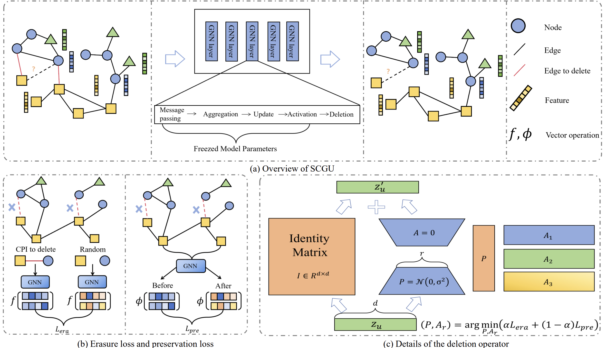
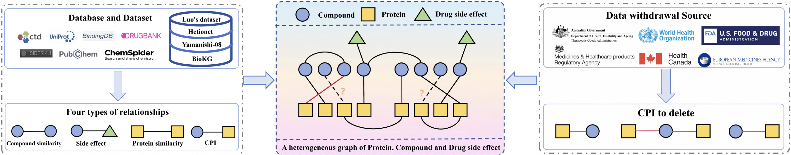

# SCGU

[Our paper.](https://www.sciencedirect.com/science/article/pii/S0950705125022270)

This project is based on the GNNDelete framework, specifically designed for deleting specified compound-protein interactions (CPI) from trained graph neural networks to achieve machine unlearning functionality.

**Our framework:**


## Project Overview

- **Heterogeneous Graph Construction**: Build heterogeneous biomedical graphs from compound, protein, and side effect data
- **Relation Types**: Support for four types of relationships
  - CPI: Compound-Protein Interaction (0/1 matrix)
  - CCS: Compound-Compound Similarity (threshold 0.6)
  - PPS: Protein-Protein Similarity (threshold 0.5) 
  - CSE: Compound-Side Effect relations (0/1 matrix)
- **Precise Deletion**: Support for deleting specified compound-protein interactions
- **Model Types**: Support for relational graph neural networks like RGCN, RGAT

### Data Sources
- Compound data: `compounds.list` (8,360 compounds)
- Protein data: `proteins.list` (1,975 proteins)
- Side effect data: `se.list` (5,854 side effects)
- Relation matrices: `CPI.npy`, `CCS.npy`, `PPS.npy`, `compound_se.npy`,`false_CPI.npy`
- [data.zip](https://github.com/yunyunfanfan/SCGU/releases/download/v1.0.0/data.zip)

**Our datset:**

## Environment Setup

### System Requirements
- Python >= 3.8
- CUDA >= 11.8 (GPU recommended)
- Memory >= 16GB
- Storage >= 10GB

### Installation

1. **Base Environment**
```bash
# Create virtual environment
conda create -n cpi_deletion python=3.9
conda activate cpi_deletion
```

2. **PyTorch Installation**
```bash
# CUDA version (recommended)
pip install torch==2.7.0 torchvision torchaudio --index-url https://download.pytorch.org/whl/cu128

# CPU version
pip install torch==2.7.0 torchvision torchaudio --index-url https://download.pytorch.org/whl/cpu
```

3. **PyTorch Geometric Installation**
```bash
pip install torch_geometric==2.6.1
pip install pyg_lib torch_scatter torch_sparse torch_cluster torch_spline_conv -f https://data.pyg.org/whl/torch-2.7.0+cu128.html
```

4. **Other Dependencies**
```bash
pip install numpy pandas scikit-learn tqdm wandb networkx ogb
```

### Data Preparation

1. **Data File Structure**
```
/root/autodl-tmp/data/
├── CPI.npy                 # Compound-protein interaction matrix
├── CCS.npy                 # Compound-compound similarity matrix
├── PPS.npy                 # Protein-protein similarity matrix
├── compound_se.npy         # Compound-side effect matrix
├── compounds.list          # List of compound names
├── proteins.list           # List of protein names
├── se.list                 # List of side effects
├── false_CPI.npy           # Compound-protein interaction matrix
└── biomedical/            # Processed data files
    ├── d_42.pkl           # Train/test data splits
    ├── df_42.pt           # Deletion masks
    └── ...
```

2. **Data Preprocessing**
```bash
python prepare_dataset.py
```

## Usage Guide

### 1. Train Original Model

```bash
# Train RGCN model
WANDB_MODE=disabled python train_gnn.py \
  --dataset biomedical \
  --gnn rgcn \
  --random_seed 42 \
  --data_dir /root/autodl-tmp/data \
  --epochs 500 \
  --valid_freq 50
```

### 2. Delete Specified Edges

#### Method 1: Delete Specific Compound-Protein Interactions
```bash
# Create edge list file to delete (format: compound_id-protein_id)
echo "5826-Q8TC05" > edges_to_delete.txt
echo "9864-P05091" >> edges_to_delete.txt

# Execute deletion
python delete_specific_edges.py \
  --edge_file edges_to_delete.txt \
  --epochs 100 \
  --valid_freq 20
```

#### Method 2: Random Deletion of Specified Number of Edges
```bash
python delete_gnn.py \
  --dataset biomedical \
  --gnn rgcn \
  --unlearning_model gnndelete \
  --df in \
  --df_size 0.1 \
  --random_seed 42
```


## Core Scripts Description

### Data Processing
- `prepare_dataset.py`: Build heterogeneous graph, set similarity thresholds


### Model Training
- `train_gnn.py`: Train original RGCN/RGAT models
- `delete_gnn.py`: Execute GNNDelete unlearning algorithm


### Evaluation Metrics
- **DT AUC/AUP**: Test set link prediction performance
- **DF AUC/AUP**: Forgetting effectiveness for deleted edges
- **Verification Error**: Consistency with retrained model

## Output Files

### Model Checkpoints
```
checkpoint/drug/rgcn/
├── original/42/                    # Original model
│   ├── model_best.pt
│   └── pred_proba.pt
└── gnndelete/                      # Post-deletion model
    └── specific_edges_false/42/
        ├── model_best.pt
        └── trainer_log.json
```

## Quick Start

### Automated Setup
```bash


# Data preprocessing
python prepare_dataset.py

# Train original model
python train_gnn.py --dataset biomedical --gnn rgcn

### Manual Setup
```bash
# Install dependencies
pip install -r requirements.txt

python delete_gnn.py \
  --dataset biomedical \
  --gnn rgcn \
  --unlearning_model gnndelete \
  --df in \
  --df_size 0.1 \
  --random_seed 42
```

## Contact

For questions, please contact the project maintainers or submit an Issue.

---
**Note**: This project is specifically designed for compound-protein interaction deletion tasks in biomedical graphs. Data formats and parameters have been optimized for this scenario.

## Cite

If you are interested in our project,please cite our paper:
```bash
@article{ZHANG2025115193,
title = {Subspace-Constrained Graph Unlearning For Forgetting High-Risk Compound-Protein Interactions},
journal = {Knowledge-Based Systems},
pages = {115193},
year = {2025},
issn = {0950-7051},
doi = {https://doi.org/10.1016/j.knosys.2025.115193},
author = {Yunjian Zhang and Rizhen Hu and Yixuan Li and Zhongfeng Kang}
}
```
